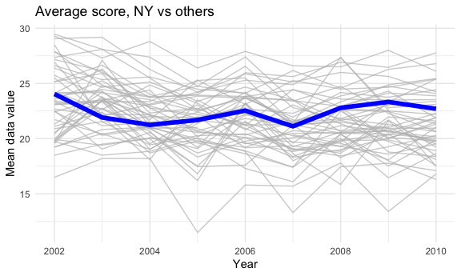

P8105: Homework \#3
================
Zachary Katz (UNI: zak2132)
10/20/2021

## Problem 1

First, we’d like to conduct some exploratory analysis of the `instacart`
dataset. Our initial step is to load the data as follows:

``` r
library(p8105.datasets)
data("instacart")
```

Before answering the questions formulated as part of Problem 1, let’s
examine the tibble in its current form and make sure it’s tidy.

``` r
# Examine head and tail of `instacart` df
head(instacart) %>% knitr::kable()
```

| order\_id | product\_id | add\_to\_cart\_order | reordered | user\_id | eval\_set | order\_number | order\_dow | order\_hour\_of\_day | days\_since\_prior\_order | product\_name                                 | aisle\_id | department\_id | aisle                | department   |
|----------:|------------:|---------------------:|----------:|---------:|:----------|--------------:|-----------:|---------------------:|--------------------------:|:----------------------------------------------|----------:|---------------:|:---------------------|:-------------|
|         1 |       49302 |                    1 |         1 |   112108 | train     |             4 |          4 |                   10 |                         9 | Bulgarian Yogurt                              |       120 |             16 | yogurt               | dairy eggs   |
|         1 |       11109 |                    2 |         1 |   112108 | train     |             4 |          4 |                   10 |                         9 | Organic 4% Milk Fat Whole Milk Cottage Cheese |       108 |             16 | other creams cheeses | dairy eggs   |
|         1 |       10246 |                    3 |         0 |   112108 | train     |             4 |          4 |                   10 |                         9 | Organic Celery Hearts                         |        83 |              4 | fresh vegetables     | produce      |
|         1 |       49683 |                    4 |         0 |   112108 | train     |             4 |          4 |                   10 |                         9 | Cucumber Kirby                                |        83 |              4 | fresh vegetables     | produce      |
|         1 |       43633 |                    5 |         1 |   112108 | train     |             4 |          4 |                   10 |                         9 | Lightly Smoked Sardines in Olive Oil          |        95 |             15 | canned meat seafood  | canned goods |
|         1 |       13176 |                    6 |         0 |   112108 | train     |             4 |          4 |                   10 |                         9 | Bag of Organic Bananas                        |        24 |              4 | fresh fruits         | produce      |

``` r
tail(instacart) %>% knitr::kable()
```

| order\_id | product\_id | add\_to\_cart\_order | reordered | user\_id | eval\_set | order\_number | order\_dow | order\_hour\_of\_day | days\_since\_prior\_order | product\_name                                                    | aisle\_id | department\_id | aisle                         | department |
|----------:|------------:|---------------------:|----------:|---------:|:----------|--------------:|-----------:|---------------------:|--------------------------:|:-----------------------------------------------------------------|----------:|---------------:|:------------------------------|:-----------|
|   3421063 |       13565 |                    2 |         1 |   169679 | train     |            30 |          0 |                   10 |                         4 | No Salt Added Gluten-Free Blue Chips Made with Organic Blue Corn |       107 |             19 | chips pretzels                | snacks     |
|   3421063 |       14233 |                    3 |         1 |   169679 | train     |            30 |          0 |                   10 |                         4 | Natural Artesian Water                                           |       115 |              7 | water seltzer sparkling water | beverages  |
|   3421063 |       35548 |                    4 |         1 |   169679 | train     |            30 |          0 |                   10 |                         4 | Twice Baked Potatoes                                             |        13 |             20 | prepared meals                | deli       |
|   3421070 |       35951 |                    1 |         1 |   139822 | train     |            15 |          6 |                   10 |                         8 | Organic Unsweetened Almond Milk                                  |        91 |             16 | soy lactosefree               | dairy eggs |
|   3421070 |       16953 |                    2 |         1 |   139822 | train     |            15 |          6 |                   10 |                         8 | Creamy Peanut Butter                                             |        88 |             13 | spreads                       | pantry     |
|   3421070 |        4724 |                    3 |         1 |   139822 | train     |            15 |          6 |                   10 |                         8 | Broccoli Florettes                                               |        32 |              4 | packaged produce              | produce    |

``` r
# Examine structure, summary, and skim
str(instacart)
```

    ## tibble [1,384,617 × 15] (S3: tbl_df/tbl/data.frame)
    ##  $ order_id              : int [1:1384617] 1 1 1 1 1 1 1 1 36 36 ...
    ##  $ product_id            : int [1:1384617] 49302 11109 10246 49683 43633 13176 47209 22035 39612 19660 ...
    ##  $ add_to_cart_order     : int [1:1384617] 1 2 3 4 5 6 7 8 1 2 ...
    ##  $ reordered             : int [1:1384617] 1 1 0 0 1 0 0 1 0 1 ...
    ##  $ user_id               : int [1:1384617] 112108 112108 112108 112108 112108 112108 112108 112108 79431 79431 ...
    ##  $ eval_set              : chr [1:1384617] "train" "train" "train" "train" ...
    ##  $ order_number          : int [1:1384617] 4 4 4 4 4 4 4 4 23 23 ...
    ##  $ order_dow             : int [1:1384617] 4 4 4 4 4 4 4 4 6 6 ...
    ##  $ order_hour_of_day     : int [1:1384617] 10 10 10 10 10 10 10 10 18 18 ...
    ##  $ days_since_prior_order: int [1:1384617] 9 9 9 9 9 9 9 9 30 30 ...
    ##  $ product_name          : chr [1:1384617] "Bulgarian Yogurt" "Organic 4% Milk Fat Whole Milk Cottage Cheese" "Organic Celery Hearts" "Cucumber Kirby" ...
    ##  $ aisle_id              : int [1:1384617] 120 108 83 83 95 24 24 21 2 115 ...
    ##  $ department_id         : int [1:1384617] 16 16 4 4 15 4 4 16 16 7 ...
    ##  $ aisle                 : chr [1:1384617] "yogurt" "other creams cheeses" "fresh vegetables" "fresh vegetables" ...
    ##  $ department            : chr [1:1384617] "dairy eggs" "dairy eggs" "produce" "produce" ...
    ##  - attr(*, "spec")=
    ##   .. cols(
    ##   ..   order_id = col_integer(),
    ##   ..   product_id = col_integer(),
    ##   ..   add_to_cart_order = col_integer(),
    ##   ..   reordered = col_integer(),
    ##   ..   user_id = col_integer(),
    ##   ..   eval_set = col_character(),
    ##   ..   order_number = col_integer(),
    ##   ..   order_dow = col_integer(),
    ##   ..   order_hour_of_day = col_integer(),
    ##   ..   days_since_prior_order = col_integer(),
    ##   ..   product_name = col_character(),
    ##   ..   aisle_id = col_integer(),
    ##   ..   department_id = col_integer(),
    ##   ..   aisle = col_character(),
    ##   ..   department = col_character()
    ##   .. )

``` r
summary(instacart)
```

    ##     order_id         product_id    add_to_cart_order   reordered     
    ##  Min.   :      1   Min.   :    1   Min.   : 1.000    Min.   :0.0000  
    ##  1st Qu.: 843370   1st Qu.:13380   1st Qu.: 3.000    1st Qu.:0.0000  
    ##  Median :1701880   Median :25298   Median : 7.000    Median :1.0000  
    ##  Mean   :1706298   Mean   :25556   Mean   : 8.758    Mean   :0.5986  
    ##  3rd Qu.:2568023   3rd Qu.:37940   3rd Qu.:12.000    3rd Qu.:1.0000  
    ##  Max.   :3421070   Max.   :49688   Max.   :80.000    Max.   :1.0000  
    ##     user_id         eval_set          order_number      order_dow    
    ##  Min.   :     1   Length:1384617     Min.   :  4.00   Min.   :0.000  
    ##  1st Qu.: 51732   Class :character   1st Qu.:  6.00   1st Qu.:1.000  
    ##  Median :102933   Mode  :character   Median : 11.00   Median :3.000  
    ##  Mean   :103113                      Mean   : 17.09   Mean   :2.701  
    ##  3rd Qu.:154959                      3rd Qu.: 21.00   3rd Qu.:5.000  
    ##  Max.   :206209                      Max.   :100.00   Max.   :6.000  
    ##  order_hour_of_day days_since_prior_order product_name          aisle_id    
    ##  Min.   : 0.00     Min.   : 0.00          Length:1384617     Min.   :  1.0  
    ##  1st Qu.:10.00     1st Qu.: 7.00          Class :character   1st Qu.: 31.0  
    ##  Median :14.00     Median :15.00          Mode  :character   Median : 83.0  
    ##  Mean   :13.58     Mean   :17.07                             Mean   : 71.3  
    ##  3rd Qu.:17.00     3rd Qu.:30.00                             3rd Qu.:107.0  
    ##  Max.   :23.00     Max.   :30.00                             Max.   :134.0  
    ##  department_id      aisle            department       
    ##  Min.   : 1.00   Length:1384617     Length:1384617    
    ##  1st Qu.: 4.00   Class :character   Class :character  
    ##  Median : 8.00   Mode  :character   Mode  :character  
    ##  Mean   : 9.84                                        
    ##  3rd Qu.:16.00                                        
    ##  Max.   :21.00

``` r
skimr::skim(instacart)
```

|                                                  |           |
|:-------------------------------------------------|:----------|
| Name                                             | instacart |
| Number of rows                                   | 1384617   |
| Number of columns                                | 15        |
| \_\_\_\_\_\_\_\_\_\_\_\_\_\_\_\_\_\_\_\_\_\_\_   |           |
| Column type frequency:                           |           |
| character                                        | 4         |
| numeric                                          | 11        |
| \_\_\_\_\_\_\_\_\_\_\_\_\_\_\_\_\_\_\_\_\_\_\_\_ |           |
| Group variables                                  | None      |

Data summary

**Variable type: character**

| skim\_variable | n\_missing | complete\_rate | min | max | empty | n\_unique | whitespace |
|:---------------|-----------:|---------------:|----:|----:|------:|----------:|-----------:|
| eval\_set      |          0 |              1 |   5 |   5 |     0 |         1 |          0 |
| product\_name  |          0 |              1 |   3 | 159 |     0 |     39123 |          0 |
| aisle          |          0 |              1 |   3 |  29 |     0 |       134 |          0 |
| department     |          0 |              1 |   4 |  15 |     0 |        21 |          0 |

**Variable type: numeric**

| skim\_variable            | n\_missing | complete\_rate |       mean |        sd |  p0 |    p25 |     p50 |     p75 |    p100 | hist  |
|:--------------------------|-----------:|---------------:|-----------:|----------:|----:|-------:|--------:|--------:|--------:|:------|
| order\_id                 |          0 |              1 | 1706297.62 | 989732.65 |   1 | 843370 | 1701880 | 2568023 | 3421070 | ▇▇▇▇▇ |
| product\_id               |          0 |              1 |   25556.24 |  14121.27 |   1 |  13380 |   25298 |   37940 |   49688 | ▆▆▇▆▇ |
| add\_to\_cart\_order      |          0 |              1 |       8.76 |      7.42 |   1 |      3 |       7 |      12 |      80 | ▇▁▁▁▁ |
| reordered                 |          0 |              1 |       0.60 |      0.49 |   0 |      0 |       1 |       1 |       1 | ▆▁▁▁▇ |
| user\_id                  |          0 |              1 |  103112.78 |  59487.15 |   1 |  51732 |  102933 |  154959 |  206209 | ▇▇▇▇▇ |
| order\_number             |          0 |              1 |      17.09 |     16.61 |   4 |      6 |      11 |      21 |     100 | ▇▂▁▁▁ |
| order\_dow                |          0 |              1 |       2.70 |      2.17 |   0 |      1 |       3 |       5 |       6 | ▇▂▂▂▆ |
| order\_hour\_of\_day      |          0 |              1 |      13.58 |      4.24 |   0 |     10 |      14 |      17 |      23 | ▁▃▇▇▃ |
| days\_since\_prior\_order |          0 |              1 |      17.07 |     10.43 |   0 |      7 |      15 |      30 |      30 | ▅▅▃▂▇ |
| aisle\_id                 |          0 |              1 |      71.30 |     38.10 |   1 |     31 |      83 |     107 |     134 | ▆▃▃▇▆ |
| department\_id            |          0 |              1 |       9.84 |      6.29 |   1 |      4 |       8 |      16 |      21 | ▇▂▂▅▂ |

Instacart is an online service that allows grocery shopping from local
stores. This data frame represents 1384617 observations, where each row
in the tibble is a product from a given user’s order. This dataset has
already been cleaned such that there is only one order per user included
here. In total, this data contains product order information for 131209
unique users.

For each observation, 15 variables are represented; our examination of
the data set above indicates that there are no missing values. The full
set of variables included is: order\_id, product\_id,
add\_to\_cart\_order, reordered, user\_id, eval\_set, order\_number,
order\_dow, order\_hour\_of\_day, days\_since\_prior\_order,
product\_name, aisle\_id, department\_id, aisle, department. Each of
these variables operates as follows:

`order_id`, `product_id`, `user_id`, `product_name`, `department_id`,
`department`, `aisle_id`, and `aisle` are identifiers of the order,
product, product’s department, and user. `add_to_cart_order`,
`order_number`, `order_dow`, `order_hour_of_day`,
`days_since_prior_order` indicate when orders were placed in the cart
and ordered both absolutely in time and relative to other orders.
`reordered` is an indicator that is 1 if a product has been ordered by
the user in the past, while `eval_set` indicates that all orders in this
data set are part of the “train” evaluation set.

Let’s clean our tibble to be a bit clearer:

``` r
instacart = instacart %>% 
      # Remove and rearrange certain columns
      select(-eval_set) %>% 
      select (order_id, product_id, user_id, everything()) %>% 
      # Recode certain variables
      mutate(reordered = as.logical(reordered))
```

Now, we can start answer questions like: How many aisles are there, and
which aisles are the most items ordered from?

To determine the number of unique aisles, we calculate as follows:

``` r
num_aisles = length(unique(pull(instacart, aisle)))
```

There are 134 aisles in total.

Now, let’s see which ones have the most items ordered from them. To
determine the aisles with the most items ordered from them, we want to
sort the aisles in descending order of observations in that aisle.

``` r
# Group by aisle and summarize number of observations in descending order
orders_by_aisle = instacart %>% 
      group_by(aisle) %>% 
      summarize(aisle_obs = n()) %>% 
      arrange(desc(aisle_obs)) 

# Check out the top 5 aisles by number of observations in table form
orders_by_aisle %>% 
      head(5) %>% 
      knitr::kable()
```

| aisle                      | aisle\_obs |
|:---------------------------|-----------:|
| fresh vegetables           |     150609 |
| fresh fruits               |     150473 |
| packaged vegetables fruits |      78493 |
| yogurt                     |      55240 |
| packaged cheese            |      41699 |

From the table, we can tell that fresh vegetables and fresh fruits are
the two aisles with the most items ordered, with over 150,000
observations each.

We can create a plot to show the number of items ordered in each aisle,
limited to aisles with more than 10,000 items ordered.

``` r
orders_by_aisle %>% 
      # Filter observations
      filter(aisle_obs > 10000) %>% 
      # Relevel aisles as factor by number of observations
      mutate(aisle = forcats::fct_reorder(aisle, aisle_obs)) %>% 
      ggplot(aes(
            x = aisle,
            y = aisle_obs)
      ) + 
      geom_bar(stat = "identity", position = position_dodge(width = 0.9), width= 0.7) + 
      # Flip X and Y axes
      coord_flip() + 
      # Label graph
      scale_fill_gradient(low = "grey", high = "black") + 
      labs(
            title = "Number of items ordered per aisle",
            y = "Number of items ordered",
            x = "Product aisle",
            caption = "Note: only includes aisles with >10K items ordered"
      )
```


Additionally, we’d like to create a table showing the three most popular
items in each of the following aisles: “baking ingredients,” “dog food
care,” and “packaged vegetables fruits.” We should also include in our
table the number of times each item is ordered.

``` r
instacart %>% 
      # Filter for appropriate aisles and group by aisle and product name
      filter(aisle == "baking ingredients" | aisle == "dog food care" | aisle == "packaged vegetables fruits") %>% 
      group_by(aisle, product_name) %>% 
      summarize(n_obs = n()) %>% 
      # Determine rank for product in each aisle by number of observations
      mutate(
            product_rank = min_rank(desc(n_obs))
      ) %>% 
      filter(product_rank < 4) %>% 
      # Arrange table by aisle and then product rank by # of obs
      arrange(aisle, product_rank) %>% 
      rename(num_orders = n_obs) %>% 
      knitr::kable()
```

| aisle                      | product\_name                                 | num\_orders | product\_rank |
|:---------------------------|:----------------------------------------------|------------:|--------------:|
| baking ingredients         | Light Brown Sugar                             |         499 |             1 |
| baking ingredients         | Pure Baking Soda                              |         387 |             2 |
| baking ingredients         | Cane Sugar                                    |         336 |             3 |
| dog food care              | Snack Sticks Chicken & Rice Recipe Dog Treats |          30 |             1 |
| dog food care              | Organix Chicken & Brown Rice Recipe           |          28 |             2 |
| dog food care              | Small Dog Biscuits                            |          26 |             3 |
| packaged vegetables fruits | Organic Baby Spinach                          |        9784 |             1 |
| packaged vegetables fruits | Organic Raspberries                           |        5546 |             2 |
| packaged vegetables fruits | Organic Blueberries                           |        4966 |             3 |

Finally, let’s create a table showing the mean hour of the day at which
Pink Lady Apples and Coffee Ice Cream are ordered on each day of the
week. Let’s have one row for apples and another for coffee, and seven
columns representing each day of the week. The value for each cell
should represent the mean hour of the day in which the product is
ordered.

``` r
instacart %>%
      # Select pink lady apples and coffee ice cream, then group by product and day of week
      select(product_name, order_dow, order_hour_of_day) %>% 
      filter(product_name %in% c("Pink Lady Apples", "Coffee Ice Cream")) %>% 
      group_by(product_name, order_dow) %>% 
      # Summarize mean for each group
      summarize(
            mean_hour = mean(order_hour_of_day)
      ) %>% 
      pivot_wider(
            names_from = "order_dow",
            values_from = "mean_hour"
      ) %>%
      # Recode column names as days of the week
      rename(
            "Sunday" = "0",
            "Monday" = "1",
            "Tuesday" = "2",
            "Wednesday" = "3",
            "Thursday" = "4",
            "Friday" = "5",
            "Saturday" = "6"
      ) %>% 
      knitr::kable()
```

| product\_name    |   Sunday |   Monday |  Tuesday | Wednesday | Thursday |   Friday | Saturday |
|:-----------------|---------:|---------:|---------:|----------:|---------:|---------:|---------:|
| Coffee Ice Cream | 13.77419 | 14.31579 | 15.38095 |  15.31818 | 15.21739 | 12.26316 | 13.83333 |
| Pink Lady Apples | 13.44118 | 11.36000 | 11.70213 |  14.25000 | 11.55172 | 12.78431 | 11.93750 |

## Problem 2

For problem 2, we use BRFSS data, so let’s load it in and check it out.

``` r
# Load the data
data("brfss_smart2010")

# Examine head and tail of `brfss_smart2010` df
head(brfss_smart2010) %>% knitr::kable()
```

| Year | Locationabbr | Locationdesc          | Class         | Topic               | Question                                                             | Response              | Sample\_Size | Data\_value | Confidence\_limit\_Low | Confidence\_limit\_High | Display\_order | Data\_value\_unit | Data\_value\_type | Data\_Value\_Footnote\_Symbol | Data\_Value\_Footnote | DataSource | ClassId | TopicId | LocationID | QuestionID | RESPID  | GeoLocation             |
|-----:|:-------------|:----------------------|:--------------|:--------------------|:---------------------------------------------------------------------|:----------------------|-------------:|------------:|-----------------------:|------------------------:|---------------:|:------------------|:------------------|:------------------------------|:----------------------|:-----------|:--------|:--------|:-----------|:-----------|:--------|:------------------------|
| 2010 | AL           | AL - Jefferson County | Health Status | Overall Health      | How is your general health?                                          | Excellent             |           94 |        18.9 |                   14.1 |                    23.6 |              1 | %                 | Crude Prevalence  | NA                            | NA                    | BRFSS      | CLASS08 | Topic41 | NA         | GENHLTH    | RESP056 | (33.518601, -86.814688) |
| 2010 | AL           | AL - Jefferson County | Health Status | Overall Health      | How is your general health?                                          | Very good             |          148 |        30.0 |                   24.9 |                    35.0 |              2 | %                 | Crude Prevalence  | NA                            | NA                    | BRFSS      | CLASS08 | Topic41 | NA         | GENHLTH    | RESP057 | (33.518601, -86.814688) |
| 2010 | AL           | AL - Jefferson County | Health Status | Overall Health      | How is your general health?                                          | Good                  |          208 |        33.1 |                   28.2 |                    38.0 |              3 | %                 | Crude Prevalence  | NA                            | NA                    | BRFSS      | CLASS08 | Topic41 | NA         | GENHLTH    | RESP058 | (33.518601, -86.814688) |
| 2010 | AL           | AL - Jefferson County | Health Status | Overall Health      | How is your general health?                                          | Fair                  |          107 |        12.5 |                    9.5 |                    15.4 |              4 | %                 | Crude Prevalence  | NA                            | NA                    | BRFSS      | CLASS08 | Topic41 | NA         | GENHLTH    | RESP059 | (33.518601, -86.814688) |
| 2010 | AL           | AL - Jefferson County | Health Status | Overall Health      | How is your general health?                                          | Poor                  |           45 |         5.5 |                    3.5 |                     7.4 |              5 | %                 | Crude Prevalence  | NA                            | NA                    | BRFSS      | CLASS08 | Topic41 | NA         | GENHLTH    | RESP060 | (33.518601, -86.814688) |
| 2010 | AL           | AL - Jefferson County | Health Status | Fair or Poor Health | Health Status (variable calculated from one or more BRFSS questions) | Good or Better Health |          450 |        82.0 |                   78.6 |                    85.3 |              6 | %                 | Crude Prevalence  | NA                            | NA                    | BRFSS      | CLASS08 | Topic24 | NA         | \_RFHLTH   | RESP061 | (33.518601, -86.814688) |

``` r
tail(brfss_smart2010) %>% knitr::kable()
```

| Year | Locationabbr | Locationdesc        | Class                       | Topic            | Question                                                                                                                         | Response | Sample\_Size | Data\_value | Confidence\_limit\_Low | Confidence\_limit\_High | Display\_order | Data\_value\_unit | Data\_value\_type | Data\_Value\_Footnote\_Symbol | Data\_Value\_Footnote | DataSource | ClassId | TopicId | LocationID | QuestionID | RESPID  | GeoLocation              |
|-----:|:-------------|:--------------------|:----------------------------|:-----------------|:---------------------------------------------------------------------------------------------------------------------------------|:---------|-------------:|------------:|-----------------------:|------------------------:|---------------:|:------------------|:------------------|:------------------------------|:----------------------|:-----------|:--------|:--------|:-----------|:-----------|:--------|:-------------------------|
| 2002 | WY           | WY - Laramie County | Prostate Cancer             | PSA Test         | Men aged 40+ who have had a PSA test within the past two years (variable calculated from one or more BRFSS questions)            | Yes      |           86 |        67.5 |                   58.7 |                    76.3 |             44 | %                 | Crude Prevalence  | NA                            | NA                    | BRFSS      | CLASS16 | Topic47 | NA         | \_RFPSA2Y  | RESP046 | (41.153225, -104.773209) |
| 2002 | WY           | WY - Laramie County | Prostate Cancer             | PSA Test         | Men aged 40+ who have had a PSA test within the past two years (variable calculated from one or more BRFSS questions)            | No       |           42 |        32.5 |                   23.7 |                    41.3 |             45 | %                 | Crude Prevalence  | NA                            | NA                    | BRFSS      | CLASS16 | Topic47 | NA         | \_RFPSA2Y  | RESP054 | (41.153225, -104.773209) |
| 2002 | WY           | WY - Laramie County | Colorectal Cancer Screening | Sigmoidoscopy    | Adults aged 50+ who have ever had a sigmoidoscopy or colonoscopy (variable calculated from one or more BRFSS questions)          | Yes      |          121 |        49.9 |                   42.8 |                    57.0 |             46 | %                 | Crude Prevalence  | NA                            | NA                    | BRFSS      | CLASS04 | Topic52 | NA         | \_RFSIGMD  | RESP046 | (41.153225, -104.773209) |
| 2002 | WY           | WY - Laramie County | Colorectal Cancer Screening | Sigmoidoscopy    | Adults aged 50+ who have ever had a sigmoidoscopy or colonoscopy (variable calculated from one or more BRFSS questions)          | No       |          124 |        50.1 |                   43.0 |                    57.2 |             47 | %                 | Crude Prevalence  | NA                            | NA                    | BRFSS      | CLASS04 | Topic52 | NA         | \_RFSIGMD  | RESP054 | (41.153225, -104.773209) |
| 2002 | WY           | WY - Laramie County | Colorectal Cancer Screening | Blood Stool Test | Adults aged 50+ who have had a blood stool test within the past two years (variable calculated from one or more BRFSS questions) | Yes      |           47 |        17.7 |                   12.7 |                    22.7 |             48 | %                 | Crude Prevalence  | NA                            | NA                    | BRFSS      | CLASS04 | Topic08 | NA         | \_RFBLDST  | RESP046 | (41.153225, -104.773209) |
| 2002 | WY           | WY - Laramie County | Colorectal Cancer Screening | Blood Stool Test | Adults aged 50+ who have had a blood stool test within the past two years (variable calculated from one or more BRFSS questions) | No       |          202 |        82.3 |                   77.3 |                    87.3 |             49 | %                 | Crude Prevalence  | NA                            | NA                    | BRFSS      | CLASS04 | Topic08 | NA         | \_RFBLDST  | RESP054 | (41.153225, -104.773209) |

``` r
# Examine structure, summary, and skim
str(brfss_smart2010)
```

    ## tibble [134,203 × 23] (S3: tbl_df/tbl/data.frame)
    ##  $ Year                      : int [1:134203] 2010 2010 2010 2010 2010 2010 2010 2010 2010 2010 ...
    ##  $ Locationabbr              : chr [1:134203] "AL" "AL" "AL" "AL" ...
    ##  $ Locationdesc              : chr [1:134203] "AL - Jefferson County" "AL - Jefferson County" "AL - Jefferson County" "AL - Jefferson County" ...
    ##  $ Class                     : chr [1:134203] "Health Status" "Health Status" "Health Status" "Health Status" ...
    ##  $ Topic                     : chr [1:134203] "Overall Health" "Overall Health" "Overall Health" "Overall Health" ...
    ##  $ Question                  : chr [1:134203] "How is your general health?" "How is your general health?" "How is your general health?" "How is your general health?" ...
    ##  $ Response                  : chr [1:134203] "Excellent" "Very good" "Good" "Fair" ...
    ##  $ Sample_Size               : int [1:134203] 94 148 208 107 45 450 152 524 77 316 ...
    ##  $ Data_value                : num [1:134203] 18.9 30 33.1 12.5 5.5 82 18 79.3 20.7 74.9 ...
    ##  $ Confidence_limit_Low      : num [1:134203] 14.1 24.9 28.2 9.5 3.5 78.6 14.6 74 15.4 68.6 ...
    ##  $ Confidence_limit_High     : num [1:134203] 23.6 35 38 15.4 7.4 85.3 21.3 84.5 25.9 81.1 ...
    ##  $ Display_order             : int [1:134203] 1 2 3 4 5 6 7 8 9 10 ...
    ##  $ Data_value_unit           : chr [1:134203] "%" "%" "%" "%" ...
    ##  $ Data_value_type           : chr [1:134203] "Crude Prevalence" "Crude Prevalence" "Crude Prevalence" "Crude Prevalence" ...
    ##  $ Data_Value_Footnote_Symbol: chr [1:134203] NA NA NA NA ...
    ##  $ Data_Value_Footnote       : chr [1:134203] NA NA NA NA ...
    ##  $ DataSource                : chr [1:134203] "BRFSS" "BRFSS" "BRFSS" "BRFSS" ...
    ##  $ ClassId                   : chr [1:134203] "CLASS08" "CLASS08" "CLASS08" "CLASS08" ...
    ##  $ TopicId                   : chr [1:134203] "Topic41" "Topic41" "Topic41" "Topic41" ...
    ##  $ LocationID                : chr [1:134203] NA NA NA NA ...
    ##  $ QuestionID                : chr [1:134203] "GENHLTH" "GENHLTH" "GENHLTH" "GENHLTH" ...
    ##  $ RESPID                    : chr [1:134203] "RESP056" "RESP057" "RESP058" "RESP059" ...
    ##  $ GeoLocation               : chr [1:134203] "(33.518601, -86.814688)" "(33.518601, -86.814688)" "(33.518601, -86.814688)" "(33.518601, -86.814688)" ...
    ##  - attr(*, "spec")=
    ##   .. cols(
    ##   ..   Year = col_integer(),
    ##   ..   Locationabbr = col_character(),
    ##   ..   Locationdesc = col_character(),
    ##   ..   Class = col_character(),
    ##   ..   Topic = col_character(),
    ##   ..   Question = col_character(),
    ##   ..   Response = col_character(),
    ##   ..   Sample_Size = col_integer(),
    ##   ..   Data_value = col_double(),
    ##   ..   Confidence_limit_Low = col_double(),
    ##   ..   Confidence_limit_High = col_double(),
    ##   ..   Display_order = col_integer(),
    ##   ..   Data_value_unit = col_character(),
    ##   ..   Data_value_type = col_character(),
    ##   ..   Data_Value_Footnote_Symbol = col_character(),
    ##   ..   Data_Value_Footnote = col_character(),
    ##   ..   DataSource = col_character(),
    ##   ..   ClassId = col_character(),
    ##   ..   TopicId = col_character(),
    ##   ..   LocationID = col_character(),
    ##   ..   QuestionID = col_character(),
    ##   ..   RESPID = col_character(),
    ##   ..   GeoLocation = col_character()
    ##   .. )

``` r
summary(brfss_smart2010)
```

    ##       Year      Locationabbr       Locationdesc          Class          
    ##  Min.   :2002   Length:134203      Length:134203      Length:134203     
    ##  1st Qu.:2005   Class :character   Class :character   Class :character  
    ##  Median :2007   Mode  :character   Mode  :character   Mode  :character  
    ##  Mean   :2007                                                           
    ##  3rd Qu.:2009                                                           
    ##  Max.   :2010                                                           
    ##                                                                         
    ##     Topic             Question           Response          Sample_Size    
    ##  Length:134203      Length:134203      Length:134203      Min.   :   1.0  
    ##  Class :character   Class :character   Class :character   1st Qu.:  59.0  
    ##  Mode  :character   Mode  :character   Mode  :character   Median : 153.0  
    ##                                                           Mean   : 271.7  
    ##                                                           3rd Qu.: 353.0  
    ##                                                           Max.   :4505.0  
    ##                                                           NA's   :2       
    ##    Data_value    Confidence_limit_Low Confidence_limit_High Display_order 
    ##  Min.   : 0.10   Min.   : 0.00        Min.   :  0.00        Min.   : 1.0  
    ##  1st Qu.:14.30   1st Qu.: 8.50        1st Qu.: 16.30        1st Qu.:16.0  
    ##  Median :33.20   Median :25.90        Median : 37.00        Median :32.0  
    ##  Mean   :43.23   Mean   :37.74        Mean   : 45.76        Mean   :32.4  
    ##  3rd Qu.:77.30   3rd Qu.:71.10        3rd Qu.: 81.55        3rd Qu.:48.0  
    ##  Max.   :99.90   Max.   :99.70        Max.   :100.00        Max.   :68.0  
    ##  NA's   :4515                                                             
    ##  Data_value_unit    Data_value_type    Data_Value_Footnote_Symbol
    ##  Length:134203      Length:134203      Length:134203             
    ##  Class :character   Class :character   Class :character          
    ##  Mode  :character   Mode  :character   Mode  :character          
    ##                                                                  
    ##                                                                  
    ##                                                                  
    ##                                                                  
    ##  Data_Value_Footnote  DataSource          ClassId            TopicId         
    ##  Length:134203       Length:134203      Length:134203      Length:134203     
    ##  Class :character    Class :character   Class :character   Class :character  
    ##  Mode  :character    Mode  :character   Mode  :character   Mode  :character  
    ##                                                                              
    ##                                                                              
    ##                                                                              
    ##                                                                              
    ##   LocationID         QuestionID           RESPID          GeoLocation       
    ##  Length:134203      Length:134203      Length:134203      Length:134203     
    ##  Class :character   Class :character   Class :character   Class :character  
    ##  Mode  :character   Mode  :character   Mode  :character   Mode  :character  
    ##                                                                             
    ##                                                                             
    ##                                                                             
    ## 

``` r
skimr::skim(brfss_smart2010)
```

|                                                  |                  |
|:-------------------------------------------------|:-----------------|
| Name                                             | brfss\_smart2010 |
| Number of rows                                   | 134203           |
| Number of columns                                | 23               |
| \_\_\_\_\_\_\_\_\_\_\_\_\_\_\_\_\_\_\_\_\_\_\_   |                  |
| Column type frequency:                           |                  |
| character                                        | 17               |
| numeric                                          | 6                |
| \_\_\_\_\_\_\_\_\_\_\_\_\_\_\_\_\_\_\_\_\_\_\_\_ |                  |
| Group variables                                  | None             |

Data summary

**Variable type: character**

| skim\_variable                | n\_missing | complete\_rate | min | max | empty | n\_unique | whitespace |
|:------------------------------|-----------:|---------------:|----:|----:|------:|----------:|-----------:|
| Locationabbr                  |          0 |           1.00 |   2 |   2 |     0 |        51 |          0 |
| Locationdesc                  |          0 |           1.00 |  15 |  33 |     0 |       404 |          0 |
| Class                         |          0 |           1.00 |  11 |  28 |     0 |        16 |          0 |
| Topic                         |          0 |           1.00 |   6 |  22 |     0 |        31 |          0 |
| Question                      |          0 |           1.00 |  27 | 172 |     0 |        40 |          0 |
| Response                      |          0 |           1.00 |   2 |  42 |     0 |        23 |          0 |
| Data\_value\_unit             |          0 |           1.00 |   1 |   1 |     0 |         1 |          0 |
| Data\_value\_type             |          0 |           1.00 |  16 |  16 |     0 |         1 |          0 |
| Data\_Value\_Footnote\_Symbol |     129688 |           0.03 |   1 |   1 |     0 |         1 |          0 |
| Data\_Value\_Footnote         |     129688 |           0.03 | 197 | 197 |     0 |         1 |          0 |
| DataSource                    |          0 |           1.00 |   5 |   5 |     0 |         1 |          0 |
| ClassId                       |          0 |           1.00 |   7 |   7 |     0 |        16 |          0 |
| TopicId                       |          0 |           1.00 |   7 |   7 |     0 |        31 |          0 |
| LocationID                    |     134203 |           0.00 |  NA |  NA |     0 |         0 |          0 |
| QuestionID                    |          0 |           1.00 |   7 |   8 |     0 |        59 |          0 |
| RESPID                        |          0 |           1.00 |   7 |   7 |     0 |        23 |          0 |
| GeoLocation                   |          0 |           1.00 |  20 |  24 |     0 |       404 |          0 |

**Variable type: numeric**

| skim\_variable          | n\_missing | complete\_rate |    mean |     sd |     p0 |    p25 |    p50 |     p75 |   p100 | hist  |
|:------------------------|-----------:|---------------:|--------:|-------:|-------:|-------:|-------:|--------:|-------:|:------|
| Year                    |          0 |           1.00 | 2006.77 |   2.39 | 2002.0 | 2005.0 | 2007.0 | 2009.00 | 2010.0 | ▃▅▃▇▇ |
| Sample\_Size            |          2 |           1.00 |  271.73 | 357.89 |    1.0 |   59.0 |  153.0 |  353.00 | 4505.0 | ▇▁▁▁▁ |
| Data\_value             |       4515 |           0.97 |   43.23 |  32.40 |    0.1 |   14.3 |   33.2 |   77.30 |   99.9 | ▇▅▂▃▅ |
| Confidence\_limit\_Low  |          0 |           1.00 |   37.74 |  32.42 |    0.0 |    8.5 |   25.9 |   71.10 |   99.7 | ▇▃▂▃▃ |
| Confidence\_limit\_High |          0 |           1.00 |   45.76 |  33.29 |    0.0 |   16.3 |   37.0 |   81.55 |  100.0 | ▇▆▃▃▇ |
| Display\_order          |          0 |           1.00 |   32.40 |  18.73 |    1.0 |   16.0 |   32.0 |   48.00 |   68.0 | ▇▇▇▇▆ |

The BRFSS data set, or Behavioral Risk Factors Surveillance System, is
intended to enable analysis of metropolitan area risk trends for
selected counties. Data is collected from a continuous system that
tracks modifiable risk factors for chronic diseases and other leading
causes of death.

Our data set contains 134203 observations and 23 variables. Let’s start
to tidy it up a bit and drill down towards what we’re interested in
examining.

``` r
brfss_smart2010 = brfss_smart2010 %>% 
      # Clean variable names
      janitor::clean_names() %>% 
      rename(
            "state" = "locationabbr",
            "county" = "locationdesc"
      ) %>% 
      # Drop columns full of missing values or that do not provide information of value
      select(-data_value_footnote_symbol, -data_value_footnote, -location_id, -data_source) %>% 
      # Focus on "Overall Health" topic
      filter(topic == "Overall Health") %>% 
      # Include only responses from "Excellent" to "Poor" %>% 
      filter(response %in% c("Excellent", "Very good", "Good", "Fair", "Poor")) %>% 
      # Organize responses as a factor taking levels ordered from "Poor" to "Excellent"
      mutate(response = factor(response, levels = c("Poor", "Fair", "Good", "Very good", "Excellent")))
```

Having tidied our data set a bit, we can begin to answer a few
questions. For example, in 2002, which states were observed at 7 or more
locations? What about in 2010?

``` r
# Filter for 2002, group by state, and sum the number of unique locations observed
brfss_smart2010 %>% 
      filter(year == 2002) %>% 
      group_by(state) %>% 
      summarize(locations_observed = length(unique(county))) %>% 
      filter(locations_observed >= 7) %>% 
      arrange(desc(locations_observed)) %>% 
      knitr::kable()
```

| state | locations\_observed |
|:------|--------------------:|
| PA    |                  10 |
| MA    |                   8 |
| NJ    |                   8 |
| CT    |                   7 |
| FL    |                   7 |
| NC    |                   7 |

``` r
# Repeat for 2010
brfss_smart2010 %>% 
      filter(year == 2010) %>% 
      group_by(state) %>% 
      summarize(locations_observed = length(unique(county))) %>% 
      filter(locations_observed >= 7) %>% 
      arrange(desc(locations_observed)) %>% 
      knitr::kable()
```

| state | locations\_observed |
|:------|--------------------:|
| FL    |                  41 |
| NJ    |                  19 |
| TX    |                  16 |
| CA    |                  12 |
| MD    |                  12 |
| NC    |                  12 |
| NE    |                  10 |
| WA    |                  10 |
| MA    |                   9 |
| NY    |                   9 |
| OH    |                   8 |
| CO    |                   7 |
| PA    |                   7 |
| SC    |                   7 |

The states that were observed at 7 or more locations in 2002 were PA,
MA, NJ, CT, FL, and NC. The states that were observed at 7 or more
locations in 2010 were FL, NJ, TX, CA, MD, NC, NE, WA, MA, NY, OH, CO,
PA, and SC – significantly more than in 2002!

We’d also like to get a better understanding of how the average
`data_value` across locations within each state changed over time for
responses labeled as “Excellent.”

``` r
brfss_smart2010 %>% 
      # Filter and group
      filter(response == "Excellent") %>% 
      group_by(state, year) %>% 
      # Create new summary measure
      summarize(
            mean_data_value = mean(data_value)
      ) %>% 
      # Develop spaghetti plot
      ggplot(aes(x = year, y = mean_data_value, group = state, color = state)) + 
      geom_line(alpha = 0.5, size=2) + 
      geom_point(alpha = 0.5) + 
      labs(
            title = "Average score for excellents by state",
            x = "Year",
            y = "Mean data value"
      ) + 
      theme(legend.position = "right")
```

    ## Warning: Removed 3 row(s) containing missing values (geom_path).

    ## Warning: Removed 4 rows containing missing values (geom_point).


The mean data value fluctuates quite a bit over time and across states.
West Virginia is a notable outlier, with lower average scores over time,
especially in 2005 and 2009, compared to other states.

I’m a bit curious how NY looks compared to the others on this metric, so
I’ll also create a graph that highlights NY’s performance in particular.

``` r
# Group for all states
all_states = brfss_smart2010 %>% 
      # Filter and group
      filter(response == "Excellent") %>% 
      group_by(state, year) %>% 
      # Create new summary measure
      summarize(
            mean_data_value = mean(data_value)
      ) 
```

    ## `summarise()` has grouped output by 'state'. You can override using the `.groups` argument.

``` r
# Filter for NY specifically
ny_only = all_states %>% 
  filter(state == "NY")

 # Develop plot
ggplot() + 
  geom_line(data = all_states, aes(x = year, y = mean_data_value, group = state), color = alpha("grey", 0.7)) + 
  geom_line(data = ny_only, aes(x = year, y = mean_data_value, color = state), color = alpha("blue", 1.0), size = 2) + 
      labs(
            title = "Average score, NY vs others",
            x = "Year",
            y = "Mean data value"
      )
```

    ## Warning: Removed 3 row(s) containing missing values (geom_path).



Looks like New York is right around the middle of the pack.

Finally, we can also create a two-panel plot showing, for 2006 and 2010,
the distribution of `data_value` for responses (“Poor” to “Excellent”)
among locations in the state of New York.

``` r
brfss_smart2010 %>% 
      filter(
            year == 2006 | year == 2010,
            state == "NY"
      ) %>% 
      # Choose necessary columns
      select(year, response, data_value) %>% 
      ggplot(aes(x = response, y = data_value)) + 
      geom_boxplot(aes(fill = response), alpha = 0.5) + 
      theme(legend.position = "none") + 
      facet_grid(~year) + 
      labs(
            title = "Distribution of `data_value` by response in NY, 2006 vs 2010",
            x = "Response category",
            y = "Data Value"
      )
```


There are a couple of interesting trends observable in this plot. The
first is the backwards-bending curve which shows “excellent” responses
generally receiving lower data value scores than “good” and “very good”
responses. Another is the general increase in data value from 2006 and
2010 for the “very good” response category in New York state.

In addition, we can visualize this in a couple of other ways as well,
just for fun: in the following, the first method looks at density across
all responses without factorizing by response, while the second method
looks at density once we factorize, or group, by response.

``` r
# Density plot without group factors
brfss_smart2010 %>% 
      filter(
            year == 2006 | year == 2010,
            state == "NY"
      ) %>% 
  group_by(year) %>% 
  ggplot(aes(x = data_value)) + 
  geom_density() + 
  facet_grid(~year)
```


``` r
# Density plot with group factors
brfss_smart2010 %>% 
      filter(
            year == 2006 | year == 2010,
            state == "NY"
      ) %>% 
  group_by(year) %>% 
  ggplot(aes(x = data_value, group = response, color = response)) + 
  geom_density() + 
  facet_grid(~year)
```


In this case, we find the extra grouping by response category to be more
informative once again. In general, as we move from “poor” to
“excellent,” the density also tends to shift towards higher values of
`data_value` – except for “excellent” responses, which revert back
towards middling values of `data_value`. From 2006 to 2010, this trend
is maintained, although we generally see a very slight increase in
density for higher values of `data_value`.

## Problem 3

Our goal in problem 3 is to load, tidy, wrangle, and explore five weeks
of accelerometer data collected from an individual admitted to the
hospital and diagnosed with congestive heart failure.

As always, let’s first load in the data.

``` r
accel_df = read_csv("Data/accel_data.csv") %>% 
      janitor::clean_names()
```

    ## Rows: 35 Columns: 1443

    ## ── Column specification ────────────────────────────────────────────────────────
    ## Delimiter: ","
    ## chr    (1): day
    ## dbl (1442): week, day_id, activity.1, activity.2, activity.3, activity.4, ac...

    ## 
    ## ℹ Use `spec()` to retrieve the full column specification for this data.
    ## ℹ Specify the column types or set `show_col_types = FALSE` to quiet this message.

Wow! This sure is a wide dataset, with \`r ncol(accel\_df) variables. As
it turns out, we need to tidy the data so that each row represents one
observation, i.e. one minute for this patient on any given date. We can
pivot longer to do that, and can also clean up the data in a few other
ways.

``` r
accel_df = accel_df %>% 
      # Pivot data
      pivot_longer(
            activity_1:activity_1440,
            names_to = "minute_id",
            names_prefix = "activity_",
            values_to = "activity_count"
      ) %>% 
      # Rename variables
      rename(
            "week_id" = "week",
            "day_of_week" = "day") %>% 
      # Include weekday vs. weekend variable
      mutate(
            "type_of_day" = 
                  ifelse(
                        day_of_week %in% c("Saturday", "Sunday"), "Weekend",
                        "Weekday"
                  )
      ) %>% 
      # Reorganize variables
      select(week_id, day_id, minute_id, day_of_week, type_of_day, activity_count) %>% 
      # Encode reasonable variable classes
      mutate(
            minute_id = as.integer(minute_id),
            day_of_week = as.factor(day_of_week),
            type_of_day = as.factor(type_of_day)
      )
```

Our tidied tibble has 50400 observations, one representing each minute
over the five weeks (35 days) of data collection. In total, there are 6
variables, with `week_id` indexing the week from 1 to 5 in which the
data was collected, `day_id` indexing the day from 1 to 35 in which the
data was collected, `minute_id` indexing the minute from 1 to 50,400 in
which the data was collected, `day_of_week` indicating the day of the
week the observation was made, `type_of_day` encoding whether the day of
week is a weekend or weekday, and `activity_count` as the outcome
variable of interest.

We can also take a quick look at the data to make sure everything looks
right:

``` r
head(accel_df) %>% knitr::kable()
```

| week\_id | day\_id | minute\_id | day\_of\_week | type\_of\_day | activity\_count |
|---------:|--------:|-----------:|:--------------|:--------------|----------------:|
|        1 |       1 |          1 | Friday        | Weekday       |        88.37778 |
|        1 |       1 |          2 | Friday        | Weekday       |        82.24444 |
|        1 |       1 |          3 | Friday        | Weekday       |        64.44444 |
|        1 |       1 |          4 | Friday        | Weekday       |        70.04444 |
|        1 |       1 |          5 | Friday        | Weekday       |        75.04444 |
|        1 |       1 |          6 | Friday        | Weekday       |        66.26667 |

``` r
tail(accel_df) %>% knitr::kable()
```

| week\_id | day\_id | minute\_id | day\_of\_week | type\_of\_day | activity\_count |
|---------:|--------:|-----------:|:--------------|:--------------|----------------:|
|        5 |      35 |       1435 | Wednesday     | Weekday       |              64 |
|        5 |      35 |       1436 | Wednesday     | Weekday       |               1 |
|        5 |      35 |       1437 | Wednesday     | Weekday       |             106 |
|        5 |      35 |       1438 | Wednesday     | Weekday       |               1 |
|        5 |      35 |       1439 | Wednesday     | Weekday       |               1 |
|        5 |      35 |       1440 | Wednesday     | Weekday       |               1 |

``` r
# Examine structure, summary, and skim
str(accel_df)
```

    ## tibble [50,400 × 6] (S3: tbl_df/tbl/data.frame)
    ##  $ week_id       : num [1:50400] 1 1 1 1 1 1 1 1 1 1 ...
    ##  $ day_id        : num [1:50400] 1 1 1 1 1 1 1 1 1 1 ...
    ##  $ minute_id     : int [1:50400] 1 2 3 4 5 6 7 8 9 10 ...
    ##  $ day_of_week   : Factor w/ 7 levels "Friday","Monday",..: 1 1 1 1 1 1 1 1 1 1 ...
    ##  $ type_of_day   : Factor w/ 2 levels "Weekday","Weekend": 1 1 1 1 1 1 1 1 1 1 ...
    ##  $ activity_count: num [1:50400] 88.4 82.2 64.4 70 75 ...

``` r
summary(accel_df)
```

    ##     week_id      day_id     minute_id         day_of_week    type_of_day   
    ##  Min.   :1   Min.   : 1   Min.   :   1.0   Friday   :7200   Weekday:36000  
    ##  1st Qu.:2   1st Qu.: 9   1st Qu.: 360.8   Monday   :7200   Weekend:14400  
    ##  Median :3   Median :18   Median : 720.5   Saturday :7200                  
    ##  Mean   :3   Mean   :18   Mean   : 720.5   Sunday   :7200                  
    ##  3rd Qu.:4   3rd Qu.:27   3rd Qu.:1080.2   Thursday :7200                  
    ##  Max.   :5   Max.   :35   Max.   :1440.0   Tuesday  :7200                  
    ##                                            Wednesday:7200                  
    ##  activity_count
    ##  Min.   :   1  
    ##  1st Qu.:   1  
    ##  Median :  74  
    ##  Mean   : 267  
    ##  3rd Qu.: 364  
    ##  Max.   :8982  
    ## 

``` r
skimr::skim(accel_df)
```

|                                                  |           |
|:-------------------------------------------------|:----------|
| Name                                             | accel\_df |
| Number of rows                                   | 50400     |
| Number of columns                                | 6         |
| \_\_\_\_\_\_\_\_\_\_\_\_\_\_\_\_\_\_\_\_\_\_\_   |           |
| Column type frequency:                           |           |
| factor                                           | 2         |
| numeric                                          | 4         |
| \_\_\_\_\_\_\_\_\_\_\_\_\_\_\_\_\_\_\_\_\_\_\_\_ |           |
| Group variables                                  | None      |

Data summary

**Variable type: factor**

| skim\_variable | n\_missing | complete\_rate | ordered | n\_unique | top\_counts                                |
|:---------------|-----------:|---------------:|:--------|----------:|:-------------------------------------------|
| day\_of\_week  |          0 |              1 | FALSE   |         7 | Fri: 7200, Mon: 7200, Sat: 7200, Sun: 7200 |
| type\_of\_day  |          0 |              1 | FALSE   |         2 | Wee: 36000, Wee: 14400                     |

**Variable type: numeric**

| skim\_variable  | n\_missing | complete\_rate |   mean |     sd |  p0 |    p25 |   p50 |     p75 | p100 | hist  |
|:----------------|-----------:|---------------:|-------:|-------:|----:|-------:|------:|--------:|-----:|:------|
| week\_id        |          0 |              1 |   3.00 |   1.41 |   1 |   2.00 |   3.0 |    4.00 |    5 | ▇▇▇▇▇ |
| day\_id         |          0 |              1 |  18.00 |  10.10 |   1 |   9.00 |  18.0 |   27.00 |   35 | ▇▇▇▇▇ |
| minute\_id      |          0 |              1 | 720.50 | 415.70 |   1 | 360.75 | 720.5 | 1080.25 | 1440 | ▇▇▇▇▇ |
| activity\_count |          0 |              1 | 267.04 | 443.16 |   1 |   1.00 |  74.0 |  364.00 | 8982 | ▇▁▁▁▁ |

Everything looks as expected! Now let’s aggregate across minutes to
create a total activity variable for each day, and then create a table
showing these totals.

``` r
total_daily = accel_df %>% 
      group_by(day_id) %>% 
      summarize(
            total_daily_activity = sum(activity_count)
      )

# Don't pipe in, because will reuse `total_daily` in a little while
total_daily %>% 
      knitr::kable()
```

| day\_id | total\_daily\_activity |
|--------:|-----------------------:|
|       1 |              480542.62 |
|       2 |               78828.07 |
|       3 |              376254.00 |
|       4 |              631105.00 |
|       5 |              355923.64 |
|       6 |              307094.24 |
|       7 |              340115.01 |
|       8 |              568839.00 |
|       9 |              295431.00 |
|      10 |              607175.00 |
|      11 |              422018.00 |
|      12 |              474048.00 |
|      13 |              423245.00 |
|      14 |              440962.00 |
|      15 |              467420.00 |
|      16 |              685910.00 |
|      17 |              382928.00 |
|      18 |              467052.00 |
|      19 |              371230.00 |
|      20 |              381507.00 |
|      21 |              468869.00 |
|      22 |              154049.00 |
|      23 |              409450.00 |
|      24 |                1440.00 |
|      25 |              260617.00 |
|      26 |              340291.00 |
|      27 |              319568.00 |
|      28 |              434460.00 |
|      29 |              620860.00 |
|      30 |              389080.00 |
|      31 |                1440.00 |
|      32 |              138421.00 |
|      33 |              549658.00 |
|      34 |              367824.00 |
|      35 |              445366.00 |

We note that on some days, such as on days 24 and 31, the
total\_daily\_activity is much lower than on other days. But we get this
just by eyeballing the table; can we construct another summary column
indicating how far each day’s total activity deviates from the mean
across days?

``` r
# Create a column that normalizes on `total_daily_activity`
total_daily_deviation = total_daily %>% 
      mutate(
            deviation = (total_daily_activity - mean(total_daily_activity)) / sd(total_daily_activity)) %>% 
      filter(abs(deviation) > 1.5) %>% 
  knitr::kable()
```

We see here a couple of outliers – namely, days 24 and 31 – that are
2.34 standard deviations below the mean. Interestingly, the
`total_daily_activity` on these days is identical, at 1440. Notably, we
know from the original tibble that days 24 and 31 are Saturdays. Day 2
is also pretty low; that’s a Monday.

We can also check to see if weekend days have a generally lower daily
activity average than weekdays, and indeed they do.

``` r
# Create table of average daily activity, grouping by weekday or weekend
accel_df %>% 
      group_by(type_of_day) %>% 
      summarize(
           average_daily_activity = mean(activity_count)
      ) %>% 
      knitr::kable()
```

| type\_of\_day | average\_daily\_activity |
|:--------------|-------------------------:|
| Weekday       |                 282.5158 |
| Weekend       |                 228.3646 |

Finally, let’s make a plot that shows the 24-hour activity time course
for each day.

``` r
# Create spaghetti plot showing 24h activity by minute for each day_id, colored by day of week
ggplot(data = accel_df, aes(x = minute_id, y = activity_count, group = day_id, color = day_of_week)) + 
      geom_line(alpha = 0.5) + 
      geom_point(alpha = 0.5) + 
      labs(
            x = "Minute of day",
            y = "Activity count",
            title = "Activity by minute per day",
            color = "Day of week"
      ) + 
      theme(legend.position = "right")
```


It’s difficult to discern distinct patterns or draw certain conclusions
from this graph, which shows perhaps too many data points. We could
possibly say that this individual has an unusually high amount of
activity on Friday evenings (\~1250 minutes into the day, which is
between 8pm and 9pm) and on Sunday around 800 minutes into the day
(about 1-2pm), as well as an unusually low amount of activity every day
of the week until several hours into the morning (\~400 minutes into the
day, which is between 6am and 7am).

As an aside, I would prefer to group by day of week first and then find
the mean at a given minute during the day, and plot that over time, like
so:

``` r
accel_df %>% 
      group_by(day_of_week, minute_id) %>% 
      summarize(
            mean_per_minute = mean(activity_count)
      ) %>% 
      ggplot(aes(x = minute_id, y = mean_per_minute, color = day_of_week)) + 
      geom_line(alpha = 0.8) +
      labs(
            x = "Minute of day",
            y = "Mean activity count",
            title = "Activity by minute grouped by day of week",
            color = "Day of week"
      ) + 
      theme(legend.position = "right")
```


